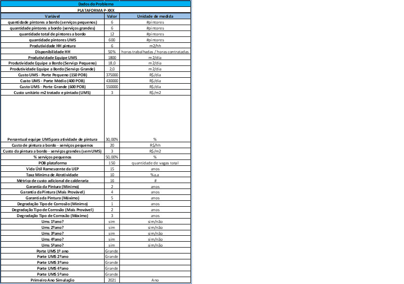
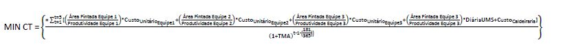
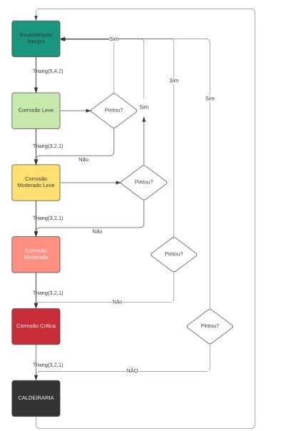
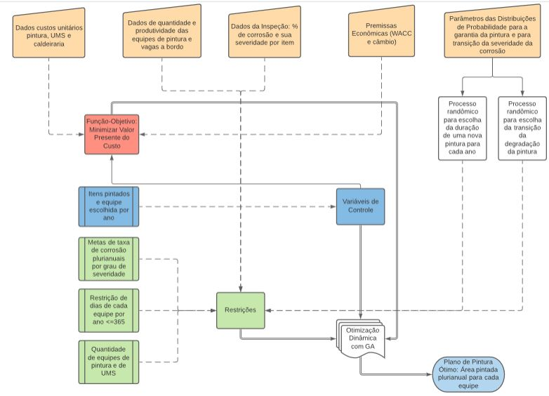
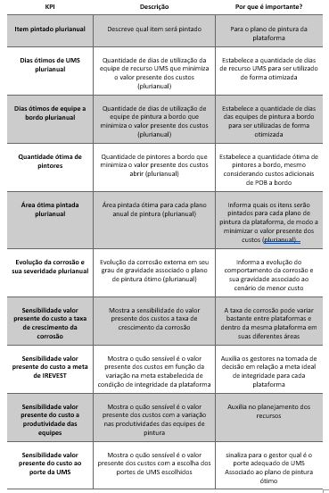

# APLICAÇÃO DE ALGORITMO GENÉTICO PARA MINIMIZAÇÃO DO CUSTO DE PINTURA E SERVIÇOS ASSOCIADOS PARA UMA PLATAFORMA DE PETRÓLEO
## 1) INTRODUÇÃO 

	A corrosão pode ser definida como a deterioração do metal pela sua reação com o ambiente (ASM, 2000). Nos ambientes marinhos das plataformas de óleo e gás a corrosão é ainda mais severa pela combinação de incidência solar, umidade e sal contido no ar (SHREMP, 1984). A corrosão afeta o negócio de upstream de diversas formas, seja afetando negativamente as receitas, CAPEX (Capital Expenditure) e OPEX (Opex Expenditure) dos projetos, seja causando problemas de integridade e segurança operacional nos ativos (KERMANI; GAROUPP, 1996). A corrosão pode atingir até 60% do custo da manutenção dos ativos na indústria de E&P (CAVASSI; FORNAGO, 1999). Outros estudos estimam o impacto total da corrosão nas atividades de upstream em cerca de 1,3 bilhões de dólares anuais (PEREZ, 2013). 
	Existem três formas da corrosão impactar os projetos de óleo e gás (KERMANI; GAROUPP, 1996): (1) Investimentos adicionais na fase de projeto para minimizar o problema da corrosão na fase de operação, (2) Impactos relacionadas ao OPEX de manutenção do campo com gastos para substituição das peças corroídas e (3) Perda de produção, com redução da eficiência operacional, tendo em vista a ocorrência de paradas na produção atribuíveis a corrosão de equipamentos na plataforma. 
	Existem algumas maneiras de se combater a corrosão nas plataformas de petróleo. As mais conhecidas são a proteção catódica, pinturas e revestimentos protetivos (IVANOV, 2016). Numa plataforma de petróleo é comum que exista uma equipe de pintores a bordo para efetuar a pintura protetiva para manter a corrosão em níveis tecnicamente aceitáveis. Essa é uma estratégia de preservação de integridade barata para o operador e usada em diversas outras indústrias. Um caso emblemático dessa estratégia é a preservação da pintura da famosa ponte Golden Gate na cidade de São Francisco. Uma equipe de pintura efetua um trabalho permanente de pintura para preservação da integridade da ponte (Bloomberg, 2015). 
	Pelo fato de que vaga a bordo é muitas vezes um recurso escasso numa UEP (Unidade Estacionária de Produção), nem sempre é possível contar com a equipe de pintores a bordo num nível adequado para conter a evolução da corrosão. Nesses casos, uma prática comum é a contratação de embarcações de UMS (Unidades de Manutenção e Segurança), que funcionam como hotéis flutuantes (“flotel”) para garantir vagas a bordo para uma grande equipe de manutenção e pintura efetuar campanhas localizadas. O problema dessa estratégia de preservação de integridade é o seu alto custo, que pode ser impeditivo em ativos em final de vida útil. Essa estratégia, portanto, pode ocasionar na não maximização do fator de recuperação do campo e antecipação do seu descomissionamento por falta de viabilidade econômica.
	Para problemas relacionados a corrosão, referente aos sistemas da plataforma, é comum a modelagem do problema de encontrar um plano de inspeção ótimo que minimize o custo total de inspeções no ciclo de vida da plataforma, considerando que a probabilidade de falha dos equipamentos seja mantida num patamar limite para cada período, com as variáveis de controle do problema sendo a frequência e qualidade da inspeção (MOURA; LINS; DROGUETT; SOARES; PASCUAL, 2014). Nesse artigo, os referidos autores utilizam o instrumental do algoritmo genético multi-objetivo para a solução do problema, conjugado com a metodologia de inspeção baseada em risco. 
	Há outras modelagens similares na literatura usando algoritmo genéticos, em uma delas é colocada uma função multi-objetivo com os objetivos de minimizar os custos totais acumulados esperados, maximizar o fator de confiança e minimizar o índice de dano máximo, sujeito às restrições de fator de confiança maior ou igual a 1 e índice de dano máximo menor ou igual a uma constante para uma plataforma fixa (TOLENTINO; RUIZ, 2013). Nesse caso, o índice de dano máximo se refere a razão entre a capacidade estrutural e a demanda estrutural e o fator de confiança se refere a um índice que leva em conta de deterioração estrutural ao longo do tempo. No caso, a variável de controle do problema é o intervalo entre manutenções.
	Outro tipo de trabalho particularmente interessante é o que modela o processo de corrosão usando cadeia de Markov não estacionário e o algoritmo genético é usado para a otimização do plano de inspeção (FUJIMOTO; KIM; HAMADA; HUANG, 1998). Nessa modelagem, a função-objetivo é a minimização do custo total de inspeção sujeito a restrição de que a probabilidade de falha para cada período não pode ficar maior do que um determinado valor. As variáveis de controle do modelo são a frequência e a qualidade das inspeções. Em relação a essa última, existem três possibilidades: nenhuma inspeção, inspeção normal e inspeção por amostragem. Na função-objetivo, os autores deixaram de fora o custo do reparo por uma questão de simplificação do modelo. 
	Dentro desse contexto, o presente trabalho visa suprimir a lacuna verificada na literatura em relação ao problema do operador em relação a escolha das áreas a serem pintadas no plano de pintura da plataforma, tendo em vista o problema a evolução da taxa de corrosão ao longo do tempo, a produtividade dos recursos e a possibilidade de uso de UMS para manter a corrosão externa em valores aceitáveis. Ou seja, o problema será traduzido na função objetivo de minimizar o custo total da pintura da plataforma em valor presente, sujeito às restrições de produtividade dos recursos, limitações de POB (Peoble on board) a bordo, taxa de corrosão máxima aceitável para a plataforma, tipo de corrosão, evolução da dinâmica da corrosão ao longo do tempo e outras possíveis restrições lógicas do problema. A variável de controle desse problema será a seleção ótima das áreas a serem pintadas para cada ano da vida útil remanescente da UEP para cada período, bem como a equipe de pintura a ser utilizada. 
	Outra importante saída desse problema será a geração de alguns indicadores, tais como indicador de pintores a bordo para a não utilização de UMS e a diferença desse KPI (Key Perfomance Index) para o número de vagas disponíveis para a pintura ao longo do tempo. Outro importante KPI será o custo em valor presente do pintor não embarcado, traduzido pelo custo incremental relacionado a utilização de UMS para compensar a não pintura a bordo. Outras sensibilidades relacionadas ao problema serão efetuadas, tal como a sensibilidade da função-objetivo devido às variações na taxa de corrosão e nas metas de enquadramento da taxa de corrosão por item e global da plataforma.  Para o teste desse algoritmo, será utilizado um caso sintético que emula um problema real de uma plataforma do tipo FPSO que opera no Brasil. 

## 2 Premissas e Dados do Problema

A tabela 1 abaixo fornece os dados básicos do problema para uma empresa de petróleo fictícia, que deverão ser alimentados pelo analista. Tais informações se referem basicamente a disponibilidade de recursos como quantidade de pintores a bordo e de quantidade de embarcações do tipo “flotel”, além da produtividade desses recursos e os seus custos unitários. 

# Tabela 1: Premissas do Problema
 
### 2.1 Função-Objetivo
	O problema que se depara o operador é minimizar o valor presente do custo total da pintura para os 5 anos a frente, que é o horizonte do plano de negócios da empresa do operador. O custo total da pintura considera os custos contratuais de materiais e serviços das equipes a bordo para a preservação da integridade da plataforma por meio de pintura da plataforma, de modo a conter o avanço da corrosão externa. Além desses custos citados, são considerados gastos relacionados à caldeiraria, quando o avanço do processo corrosivo é excessivo e se faz necessário tal atividade. Por último, outros gastos considerados como parte dessa função-custo a ser minimizada, é o gasto com embarcação de apoio (“Flotel” ou “UMS”) para suportar campanha de pintura. Segue abaixo a síntese da composição da função-objetivo, conforme descrito. 
#### Função-Objetivo

Onde:
CT = Custo Total da Pintura (Mil R$)
TMA = Taxa Mínima de Atratividade (%a.a)

### 2.2 Restrições
	As restrições desse problema são basicamente as restrições de máximo permissível de taxa de corrosão para cada item alvo da inspeção de corrosão externa da plataforma como um todo, além do grau de severidade permitido para cada tipo de corrosão, de modo a satisfazer aos requisitos de integridade e segurança da plataforma do operador da plataforma, seja para atendimento a padrões de qualidade internos ou externos ou mesmo compromisso com órgão regulador.
	Outra restrição do problema é a quantidade de equipes dedicadas a pintura na plataforma, que são três. Duas referentes a equipes a bordo que efetuam pintura o ano inteiro, mas tem a sua precificação de cobrança distinta, pois um é cobrado em reais por homem-hora e outro é por R$ por m2 efetivamente pintado. Por último, há a restrição lógica de que cada equipe de pintura individualmente não pode ultrapassar 365 dias de atividade de pintura por ano. As equações abaixo mostram claramente as referidas restrições da função-objetivo do problema. 
 

#### IREVEST≥Meta_Plataforma_para_Ano_1
#### IREVEST≥Meta_Plataforma_para_Ano_2
#### IREVEST≥Meta_Plataforma_para_Ano_3
#### IREVEST≥Meta_Plataforma_para_Ano_4
#### IREVEST≥Meta_Plataforma_para_Ano_5
#### IREVEST_Tipo_X≥ Meta_Plataforma_para_Tipo_Ano_1
#### IREVEST_Tipo_X≥ Meta_Plataforma_para_Tipo_Ano_2
#### IREVEST_Tipo_X≥ Meta_Plataforma_para_Tipo_Ano_3
#### IREVEST_Tipo_X≥ Meta_Plataforma_para_Tipo_Ano_4
#### IREVEST_Tipo_X≥ Meta_Plataforma_para_Tipo_Ano_5
#### Dias Equipe 1≤365,para cada ano
#### Dias Equipe 2≤365,para cada ano
#### Dias Equipe 3≤365,para cada ano

Onde: 
X = Grau de Corrosão: L(Leve), ML (Moderada Leve), M (Moderada) ou C (Crítica)
IREVEST = 1- (Área Corroída/Área Total)

### 2.3 Variáveis de Controle
	As variáveis de controle do problema é quais itens serão pintados para cada ano prospectivo e qual será a equipe de pintura utilizada par cada item, sendo as opções a não pintura (número inteiro 0), equipes a bordo (números 1 e 2 para as equipes 1 e 2) e a equipe da UMS (número 3 – para equipe 3). 
### 2.4 Evolução da Dinâmica da Corrosão na Plataforma de Óleo e Gás
	Para a modelagem do problema da minimização do custo do plano de pintura sujeito a evolução das metas de corrosividade e sua severidade nas plataformas é preciso modelar o seu comportamento ao longo do tempo e sua dinâmica de transição entre estados. No caso, para toda e qualquer nova pintura, foi assumido que o tempo de garantia de pintura, ou seja, o tempo em que o revestimento fica íntegro, tem o comportamento de uma distribuição triangular (Triang(4,5,2)). O nível de assimetria da distribuição, para cada plataforma, é determinado pelo nível de cuidado da equipe a bordo, onde as equipes que são mais ativas na preservação da pintura conseguem preservá-las integras por mais tempo, o que torna a distribuição mais assimétrica a direita. 
	Foi considerado que após a passagem de tempo de garantia de pintura de cada item, se não houvesse qualquer nova pintura, o estado da pintura vai naturalmente se degradar conforme a ordem listada abaixo. O tempo de deterioração, por sua vez, ocorreria de acordo com distribuição triangular (Triang(3,2,1)). O último estágio ocorre quando o nível de corrosão é tão alto que se faz necessário atividades de caldeiraria para efetuar a troca do trecho danificado, que quando ocorre é um evento muito mais caro que a atividade de pintura. Quando se atinge a necessidade de caldeiraria há uma penalização em termos de custo por uma métrica de n vezes o custo da pintura.  A figura 1 fornece um resumo da dinâmica da evolução dos estados de corrosão do modelo. A figura 2, por sua vez, resume todos os componentes da modelagem, com a aplicação da função de algoritmo genético do Solver do Excel, com as configurações default do sistema para esse algoritmo. A planilha “Otimizador de Custos de Corrosão_V12.xlsxm” contém um protótipo funcional da modelagem da figura 2. 

### I→L→ML→M→C→CALD→I, onde:

I = Revestimento Íntegro
L = Revestimento com corrosão do tipo Leve
ML = Revestimento com corrosão do tipo Moderado Leve. 
M = Revestimento com corrosão do tipo Moderado.
C = Revestimento com corrosão do tipo Crítico. 
CALD = Caldeiraria.

#### Figura 1: Dinâmica da Transição de Estados

#### Figura 2: Modelagem do Problema da Minimização do Custo do Plano de Pintura

### 3 Saídas da Otimização
	As principais saídas da utilização são: O que será pintado e qual equipe irá pintar de modo a minimizar o custo total, além disso, tem-se também à quantidade ótima de dias de utilização dos recursos, tais como dias de utilização das equipes de pintura, UMS, custo total da pintura plurianual bem como o seu custo em valor presente, associado ao cenário de menor custo que atende as restrições do problema.
	Outra saída possível da otimização é a quantidade ótima de pintores. Em outras palavras, um KPI que mede a quantidade de pintores que minimiza os custos totais. Para esse indicador, se deve levar em conta os custos adicionais de um pintor adicional, como por exemplo, o custo de logística aérea e outros custos, o que deverá ser feito numa versão posterior desse modelo.   
	Outro indicador aqui também é resultado da modelagem é a evolução da área pintada plurianual por item, bem como a evolução da corrosão e sua severidade ao longo da vida útil remanescente da plataforma, dado os limites impostos de corrosão considerados no problema. 
	Outras sensibilidades importantes derivadas da modelagem são as que medem o impacto adicional nos custos como resultado da variação nas metas de IREVEST, na taxa de crescimento da corrosão, tamanho e produtividade das equipes de pintura, bem como sensibilidades do custo com relação ao porte da embarcação de UMS necessário, sempre associados ao cenário de menor custo. Segue na tabela 2 o resumo dos indicadores e sensibilidades gerada pela modelagem proposta, bem como sua importância para o processo. 
	Outro aspecto interessante da modelagem é que quando não há recursos disponíveis em quantidades suficientes para atendimento as restrições estabelecidas não há solução para o modelo. E isso indica que o planejador deverá rever suas metas ou remanejar recursos para que a solução seja viável.  

#tabela 2: KPIs - Descritivo

## 4 CONCLUSÕES E TRABALHOS FUTUROS

	Tendo em vista a importância da corrosão nos custos de uma plataforma de óleo e gás, os gestores e analistas devem se atentar ao impacto deste problema no ciclo de vida de uma UEP, se o objetivo da empresa for a maximização do valor. O presente trabalho fornece uma contribuição nesse sentido, dado que fornece uma ferramenta de apoio à decisão que permite a empresa de petróleo efetuar o planejamento ótimo considerando o menor valor presente dos custos associados a pintura e preservação da integridade, enquanto atende as restrições técnicas de metas de condição de integridade estabelecida pela própria organização. Mais ainda, auxilia no estabelecimento dessas metas, ao considerar as especificidades de cada plataforma e assim, portanto, dando suporte a maximização de valor.  
	Um ponto importante desse trabalho é que a aplicabilidade da ferramenta é tanto para projetos que já estão em andamento, de modo a dar suporte as equipes de engenharia que planejam recursos e trabalham na preservação da integridade da plataforma, quanto para as plataformas que ainda serão construídas. Nesse segundo caso, decisões como a quantidade de leitos disponíveis na plataforma para evitar o uso de recursos como o UMS, por exemplo, tem que ser planejado desde o início, no intuito de maximizar o valor do negócio. 
	É importante destacar que a visão de valor estará completa quando for incorporada a dimensão de perdas de produção provocadas pela corrosão externa, o que não foi tratado no presente trabalho. Mas que poderá ser incorporado em trabalhos futuros ao introduzir mais uma função objetivo (minimização de perdas de produção) ou modificar a função objetivo de minimizar o valor presente dos custos por maximizar o valor presente dos lucros. Nessa segunda alternativa, as perdas entrariam com um componente de receita. 

	
	
## 5 BIBLIOGRAFIA
	

ASM, ASM International - Corrosion: Understanding the Basics. Chapter 1: The effects and Economic Impact of Corrosion, 2000.

Bloomberg. Acessado em 11/12/2020 <https://www.bloomberg.com/news/articles/2015-04-15/the-never-ending-job-of-painting-the-golden-gate-bridge>

CAVASSI, P; CORNAGO, M. The Cost of Corrosion in the Oil Industry. JCPL, maio de 1999.  

FUJIMOTO, Y; KIM, S; HAMADA, K.; HUANG, F. Inspection planning using genetic algorithm for fatigue deterioration structure. International Offshore and Polar Engineering Conference. Montreal, Canada, 1998.

IVANOV, H. University of Acron. Honor Research Projects. Spring, 2016. 

M. B. KERMANI; HAROUPP, Don. The impact of Corrosion on the oil and gas industry. SPE Production and Facilities, 1996.

MOURA, M; LINS, I; DROGUETT, E; SOARES, R; PASCUAL, R. A multi-objective genetic alogorithm for determining efficient risk-based inspection programs. Reliability Engineering and System Safety. Elsevier, 2014.

PEREZ, T; Corrosion in the oil and Gas Industry: An Increasing Challenge for Materials. JOM The Journal of The Minerals, Metals & Materials Society, Vol. 65, n.8, 2013. 

TOLENTINO, Dante; RUIZ, Sonia. Time Intervals for Maintenance of Offshore Structures Based on Multiobjective optimization. Hinedawi Publishing Corporation. Mathematical Problems in Engineering. Volume 13, 2013. 

